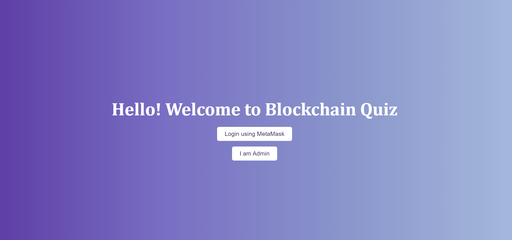
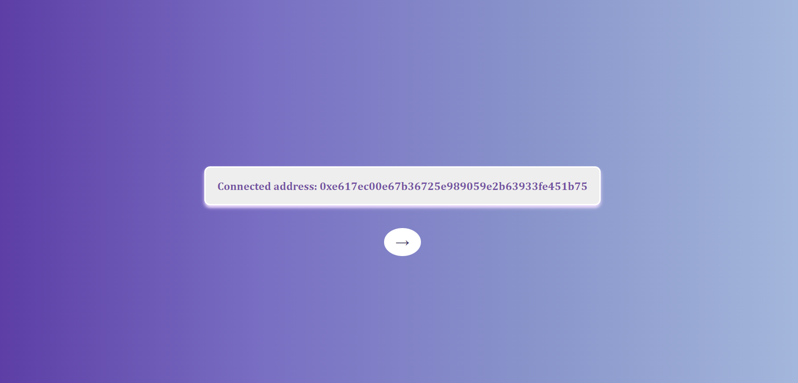

# Blockchain Project: Decentralized Quiz App

## Overview

The Blockchain Quiz App is an interactive web platform designed to help users learn more about blockchain technology. It currently offers 20 quiz questions, with plans to expand the number to over 50. Users are required to log in with their MetaMask wallet to access the quiz.

---

## Features

- **MetaMask Integration**: Users must connect their MetaMask wallet to access the quiz, ensuring a secure and decentralized user experience.
  
- **Interactive Quiz**: The quiz presents a series of questions, and users receive immediate feedback on their answers. Correct answers are highlighted in green, while incorrect ones appear in red.

- **Progress Tracking**: On the right side of the page, users can see a progress bar showing their advancement through the quiz. The progress bar also indicates whether the questions have been answered correctly. An icon of a watch is displayed when a question is unanswered, and once answered, the icon switches to either an "X" for incorrect or a check mark for correct answers.

- **Results Modal**: Once the user completes the quiz, a modal displays the number of correct answers. The user has the option to retry the quiz if they wish to improve their score.

- **FAQ Section**: A dedicated section with frequently asked questions (FAQ) about the quiz and the blockchain project.

- **Project Information**: The "About" section provides detailed information about the app.

- **Contact Us**: Users can send messages through the "Contact Us" form if they have feedback, suggestions, or questions regarding the quiz. To submit a message, users must be logged into MetaMask and enable transactions.

- **Admin Login**: An admin can log in on the homepage to manage the quiz content. When logged in, the admin has access to a form where they can add new questions to the quiz.

- **Add New Questions**: In the admin panel, the admin can select the question title, possible answers, and specify the correct answer. After adding a question, it will immediately be displayed on the homepage for users to answer. The new question will also appear in the admin panel under "Existing Questions," where the admin can manage the questions.

- **Delete Questions**: The admin can delete questions from the "Existing Questions" section on the admin page. Deleting a question removes it from both the admin panel and the homepage.

- **Manage Contact Form Submissions**: When a user submits a message through the "Contact Us" form, the admin can view the sender's name, email, and message. The admin has the option to delete any message from the admin panel once it has been read.

---

## UI Design

The user interface (UI) has been designed with a clean and modern aesthetic, primarily using various shades of **purple** throughout the app. A gradient of purple tones is used in key UI components, giving the app a visually appealing and cohesive look. The progress bar also features unique icons to indicate unanswered, incorrect, and correct answers, providing a smooth user experience.

---

## How It Works

1. **Login**: Users must connect their MetaMask wallet to start the quiz. Admins can log in on the homepage to access the admin panel.
2. **Answer Questions**: Users select answers and immediately see if they are correct or incorrect (green for correct, red for incorrect).
3. **Track Progress**: Users can track their progress with a visual progress bar showing which questions have been answered and whether they were correct.
4. **View Results**: After completing the quiz, users can see their score and have the option to retake the quiz for better results.
5. **Submit Feedback**: Users can send feedback or contact us via the "Contact Us" form. To submit, they must be logged into MetaMask and enable transactions.
6. **Admin Features**:
   - Admin can log in and add new questions through a dedicated form. 
   - Admin can manage questions by deleting them from the "Existing Questions" section.
   - Admin can view submitted messages, including the name, email, and message from users, and delete them after reading.

---

## Future Updates

- The number of questions will be expanded to over 50.
- Additional features and improvements will be implemented based on user feedback.

---

## Screenshots of the Website

---

